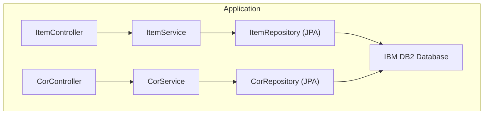

<div align="center">

# 🏗️ Bartz Móveis ERP API

### REST API de Integração (Ponte) para o ERP Legado (IBM DB2)

[](https://www.oracle.com/java/)
[](https://spring.io/projects/spring-boot)
[](https://www.ibm.com/products/db2)
[](https://www.docker.com/)
[](#-segurança)
[](https://swagger.io/)

</div>

---

## 📸 Preview (Swagger UI)

<div align="center">
  
</div>

---

## 📌 Sobre o Projeto

A **Bartz Móveis ERP API** foi concebida para atuar como uma **Camada Anticorrupção (Ponte)**. Ela resolve o problema de acesso direto a um sistema ERP legado ancorado em um banco de dados **IBM DB2**, o que dificulta a integração com front-ends modernos e expõe credenciais sensíveis.

A API encapsula o acesso nativo e restrito do DB2 entregando serviços RESTful padronizados em JSON, com suporte a paginação e filtros avançados.

Construída com foco em **produção real**, a API incorpora:

- ✅ **Arquitetura em camadas** (Controller → Service → Repository → Model)
- ✅ **Segurança Stateless** via JWT (Pacote Modular `jwt-package`)
- ✅ **Camada Anticorrupção** isolando o legado DB2
- ✅ **Containerização completa** com Docker e Docker Compose
- ✅ **Documentação interativa** com Swagger / OpenAPI 3
- ✅ **Suíte de testes** com JUnit 5 e Mockito
- ✅ **Tratamento Global de Erros** para respostas padronizadas

---

## 🏛️ Arquitetura

### Padrão MVC + Service Layer



### Estrutura de Pastas

```
📦 apigetitem
 ├── 🔐 security/            # Filtros de segurança (ApiKeyFilter)
 ├── ⚙️ config/              # Configurações de Segurança e Propriedades
 ├── 📡 controller/          # Endpoints REST (ItemController, CorController)
 ├── 🧩 service/             # Regras de negócio e lógica de aplicação
 ├── 🗄️ repository/          # Interfaces JPA para acesso ao IBM DB2
 ├── 🏷️ model/               # Entidades JPA mapeadas para o banco
 ├── 📤 dto/                 # Data Transfer Objects (ErrorResponse)
 └── ⚠️ exceptions/          # Tratamento global de erros (GlobalExceptionHandler)
```

---

## 🚀 Endpoints da API

### 📦 Itens (`/itens`)
| Método | Endpoint | Parâmetro | Descrição | Auth |
|--------|----------|-----------|-----------|------|
| `GET` | `/itens` | - | Lista todos | ✅ |
| `GET` | `/itens/search` | `codigo` | Busca por código exato ou parcial | ✅ |
| `GET` | `/itens/search` | `descricao` | Busca por descrição exata ou parcial | ✅ |

### 🎨 Cores (`/cores`)
| Método | Endpoint | Parâmetro | Descrição | Auth |
|--------|----------|-----------|-----------|------|
| `GET` | `/cores` | - | Lista todas | ✅ |
| `GET` | `/cores/search` | `codigo` | Busca por sigla/código | ✅ |
| `GET` | `/cores/search` | `descricao` | Busca por descrição | ✅ |

---

## 🔐 Segurança

A autenticação é baseada em **JWT (JSON Web Token)** de forma totalmente Stateless. O projeto utiliza o pacote modular `jwt-package` para gerenciar a segurança de forma eficiente.

**Header Obrigatório:**
```http
Authorization: Bearer <seu_token_jwt>
```

**Fluxo Interno:**
1. O `JwtAuthFilter` intercepta a requisição.
2. Valida o token usando a `jwt.secret-key` definida no `.env`.
3. Verifica se o token não expirou e se a assinatura é válida.
4. Se válido, libera o acesso aos dados do DB2.
5. Se inválido, ausente ou expirado, retorna `401 Unauthorized`.

---

## 🧪 Testes

A API possui cobertura de testes automatizados para garantir a integridade da ponte de dados:

| Camada | Ferramenta | Classes de Teste |
|--------|------------|-----------------|
| **Service (Unit)** | JUnit 5 + Mockito | `BartzErpServiceTest` |
| **Controller (Integration)** | `@WebMvcTest` + MockMvc | `BartzErpControllerTest` |

```bash
# Executar todos os testes
./mvnw test
```

---

## 🐳 Rodando com Docker (Produção)

A forma mais robusta de subir a API em qualquer ambiente:

**1. Configure as variáveis de ambiente:**
Crie um arquivo `.env` na raiz do projeto:

```env
# .env
jwt.secret-key=sua_chave_secreta_com_no_minimo_32_chars
jwt.excluded-paths=/auth/login, /swagger-ui/**, /v3/api-docs/**
jwt.expiration-time=43200000
DB_URL=jdbc:db2://seu_host:50000/nomedobanco
DB_USERNAME=usuario_db2
DB_PASSWORD=senha_db2
```

**2. Suba o container:**
```bash
docker-compose up --build -d
```

**3. Verifique o status:**
```bash
docker-compose ps
docker-compose logs -f app
```

---

## 💻 Rodando Localmente (Desenvolvimento)

**Pré-requisitos:**
- Java 17+
- Maven 3.9+
- Acesso ao banco IBM DB2

```bash
# Clone o repositório
git clone <url-do-repositorio>
cd apigetitem

# Execute a aplicação via Maven
./mvnw spring-boot:run
```

---

## 📖 Documentação Interativa (Swagger)

Com a aplicação rodando, acesse:

```
http://localhost:8081/swagger-ui.html
```

Você terá acesso a **todos os endpoints documentados**, com possibilidade de testar as queries para o DB2 diretamente pelo navegador, incluindo o campo para inserir a `X-API-KEY`.

---

## 📊 Estrutura de Dados (DB2)

A API interage com as tabelas principais do ERP:

- **Tabela `ITEM`**: Mapeia `codeItem` (ITEM), `description` (DESCRICAO) e `refComercial` (REF_COMERCIAL).
- **Tabela `COR`**: Mapeia `siglaCor` (SIGLA_COR) e `descricao` (DESCRICAO).

---

## 🛠️ Stack Tecnológica

| Tecnologia | Versão | Finalidade |
|-----------|--------|------------|
| Java | 17 (LTS) | Linguagem principal |
| Spring Boot | 3.4.2 | Framework web e IoC |
| Spring Data JPA | — | ORM e persistência |
| Spring Security | 6.4.x | Controle de acesso via JWT |
| JWT Package | 1.0.3 | Pacote customizado para gestão de tokens |
| IBM DB2 | 12.1 | Banco de dados legado |
| SpringDoc OpenAPI | 2.0 | Documentação Swagger |
| Lombok | — | Redução de boilerplate |
| Docker + Compose | — | Containerização |
| JUnit 5 + Mockito | — | Testes automatizados |
| Maven | 3.9+ | Gerenciamento de build |

---

## 🆘 Solução de Problemas

### Erro: `JWT signature does not match`
- Verifique se a `jwt.secret-key` no `.env` é exatamente a mesma que foi usada para gerar o token.
- Certifique-se de que a chave tem pelo menos 32 caracteres.

---

## 👨💻 Autor

Desenvolvido por **Roberto Lara** — Full Stack Developer

[](https://github.com/betolara1)

---

<div align="center">

**Bartz Móveis ERP API** — A ponte segura para seus dados legados.

</div>
